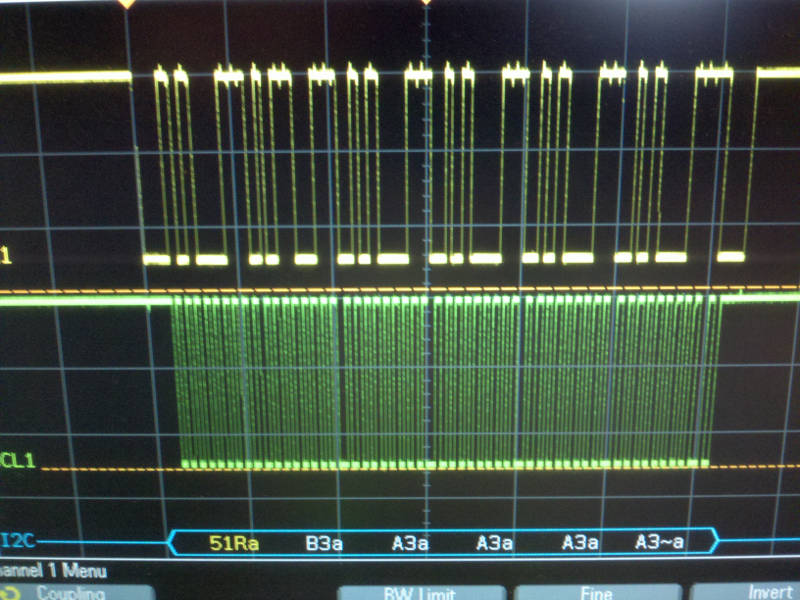

# Twi01Dx

## Overview

I have had little luck with the TWI peripheral libraries I have ported to this chip, so it is time to look at other options.

This is from <https://github.com/cv007/Avr01Dx_Twi>

## Firmware Upload

 Run 'make all' to compile and 'make updi' to upload.

```bash
sudo apt-get install make git gcc-avr binutils-avr gdb-avr avr-libc python3-pip
pip3 install pymcuprog
git clone https://github.com/epccs/MacGyver/
cd /MacGyver/Applications/Avr01Dx_Twi-main
make all
avr-gcc -Os -g -std=gnu99 -Wall -fshort-enums -ffunction-sections -fdata-sections  -DF_CPU=16000000UL -I.  -mmcu=avr128da28 -B ../lib/AVR-Dx_DFP/gcc/dev/avr128da28/ -I ../lib/AVR-Dx_DFP/include/ -c -o main.o main.c
avr-gcc -Os -g -std=gnu99 -Wall -fshort-enums -ffunction-sections -fdata-sections  -DF_CPU=16000000UL -I.  -mmcu=avr128da28 -B ../lib/AVR-Dx_DFP/gcc/dev/avr128da28/ -I ../lib/AVR-Dx_DFP/include/ -c -o ds3231.o ds3231.c
avr-gcc -Os -g -std=gnu99 -Wall -fshort-enums -ffunction-sections -fdata-sections  -DF_CPU=16000000UL -I.  -mmcu=avr128da28 -B ../lib/AVR-Dx_DFP/gcc/dev/avr128da28/ -I ../lib/AVR-Dx_DFP/include/ -c -o twim.o twim.c
avr-gcc -Os -g -std=gnu99 -Wall -fshort-enums -ffunction-sections -fdata-sections  -DF_CPU=16000000UL -I.  -mmcu=avr128da28 -B ../lib/AVR-Dx_DFP/gcc/dev/avr128da28/ -I ../lib/AVR-Dx_DFP/include/ -c -o twis.o twis.c
avr-gcc -Os -g -std=gnu99 -Wall -fshort-enums -ffunction-sections -fdata-sections  -DF_CPU=16000000UL -I.  -mmcu=avr128da28 -B ../lib/AVR-Dx_DFP/gcc/dev/avr128da28/ -I ../lib/AVR-Dx_DFP/include/ -c -o ../lib/timers_bsd.o ../lib/timers_bsd.c
avr-gcc -Os -g -std=gnu99 -Wall -fshort-enums -ffunction-sections -fdata-sections  -DF_CPU=16000000UL -I.  -mmcu=avr128da28 -B ../lib/AVR-Dx_DFP/gcc/dev/avr128da28/ -I ../lib/AVR-Dx_DFP/include/ -c -o ../lib/uart0_bsd.o ../lib/uart0_bsd.c
avr-gcc -Wl,-Map,Twi01Dx.map  -Wl,--gc-sections  -mmcu=avr128da28 -B ../lib/AVR-Dx_DFP/gcc/dev/avr128da28/ -I ../lib/AVR-Dx_DFP/include/ main.o ds3231.o twim.o twis.o ../lib/timers_bsd.o ../lib/uart0_bsd.o -o Twi01Dx.elf
avr-size Twi01Dx.elf
   text    data     bss     dec     hex filename
   3018      14      95    3127     c37 Twi01Dx.elf
rm -f Twi01Dx.o main.o ds3231.o twim.o twis.o ../lib/timers_bsd.o ../lib/uart0_bsd.o
avr-objcopy -j .text -j .data -O ihex Twi01Dx.elf Twi01Dx.hex
avr-objdump -h -S Twi01Dx.elf > Twi01Dx.lst
```

Upload uses the pymcuprog tool, the upload only works with my MacGyver board and a RPUusb board (where the R-Pi goes) at this time.

```bash
make updi
testing for prerequesetits a false will stop make
which python3 2>/dev/null || false
/usr/bin/python3
which pymcuprog 2>/dev/null || false
/home/rsutherland/.local/bin/pymcuprog
ls ../../../MacGyver/Manager/AppUpload/AppUPDImode.py 2>/dev/null || false
../../../MacGyver/Manager/AppUpload/AppUPDImode.py
ls ../../../MacGyver/Manager/AppUpload/AppUARTmode.py 2>/dev/null || false
../../../MacGyver/Manager/AppUpload/AppUARTmode.py
python3 ../../../MacGyver/Manager/AppUpload/AppUPDImode.py
bootmsg: i2c-debug at addr 48: commands include
bootmsg: /0/id?
bootmsg: 
cmd echo: /0/iaddr 42
response: {"master_address":"0x2A"}
#: Manager/AppUpload firmware looks for a 7 on i2c to enable Application UPID mode
cmd echo: /0/ibuff 7
response: {"txBuffer[1]":[{"data":"0x7"}]}
cmd echo: /0/iread? 1
response: {"txBuffer":"wrt_success","rxBuffer":"rd_success","rxBuffer":[{"data":"0x7"}]}
pymcuprog erase -t uart -u /dev/ttyUSB0 -d avr128da28
Chip/Bulk erase,
Memory type eeprom is conditionally erased (depending upon EESAVE fuse setting)
Memory type flash is always erased
Memory type internal_sram is always erased
Memory type lockbits is always erased
...
Erased.
Done.
pymcuprog write -t uart -u /dev/ttyUSB0 -d avr128da28 --verify -f Twi01Dx.hex
Writing from hex file...
Writing flash...
Verifying flash...
OK
Done.
python3 ../../../MacGyver/Manager/AppUpload/AppUARTmode.py
bootmsg: i2c-debug at addr 48: commands include
bootmsg: /0/id?
bootmsg: 
cmd echo: /0/iaddr 42
response: {"master_address":"0x2A"}
#: Manager/AppUpload firmware looks for anything except 7 on i2c to enable Application UART mode
cmd echo: /0/ibuff 0
response: {"txBuffer[1]":[{"data":"0x0"}]}
cmd echo: /0/iread? 1
response: {"txBuffer":"wrt_success","rxBuffer":"rd_success","rxBuffer":[{"data":"0x0"}]}
```

## How To Use

Get out your Oscilloscope, it helps to have one with i2c serial decode (note on an Agilent 2k series 51R~A means the address did not get Ack)

Not ack by ... lets call it the server to be PC.


Both the client and server (PC) are running on the same chip, try that with a 328p.


