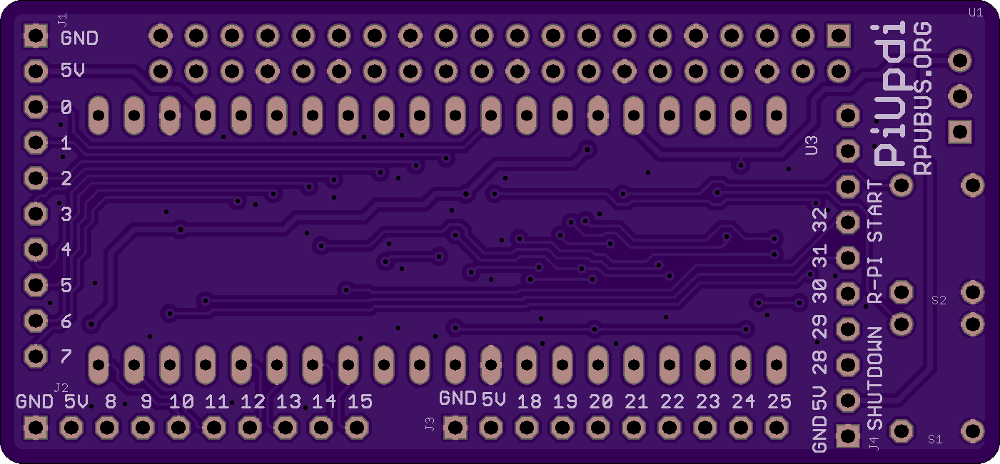
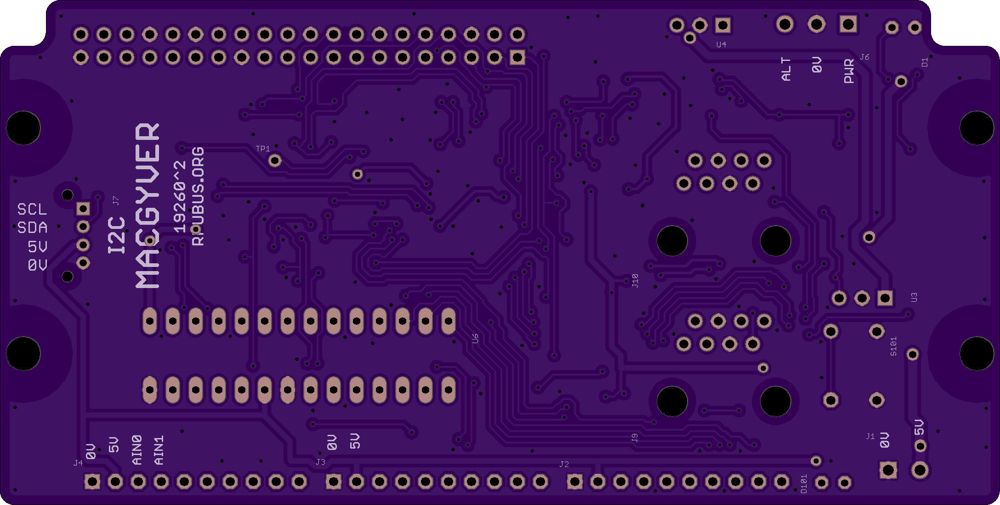
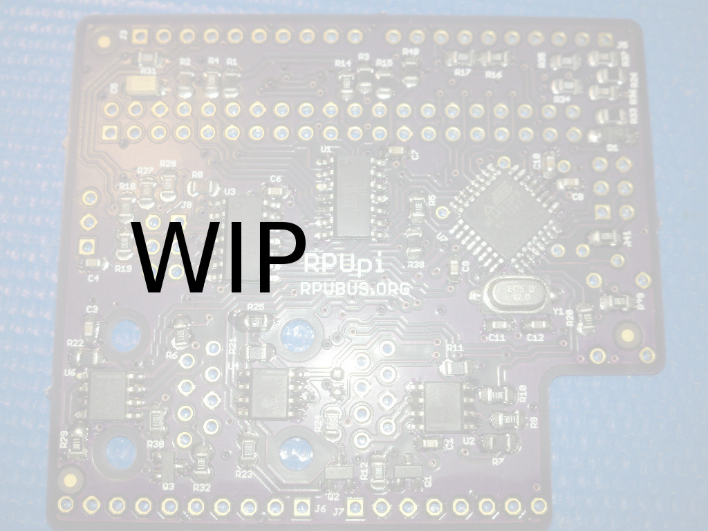
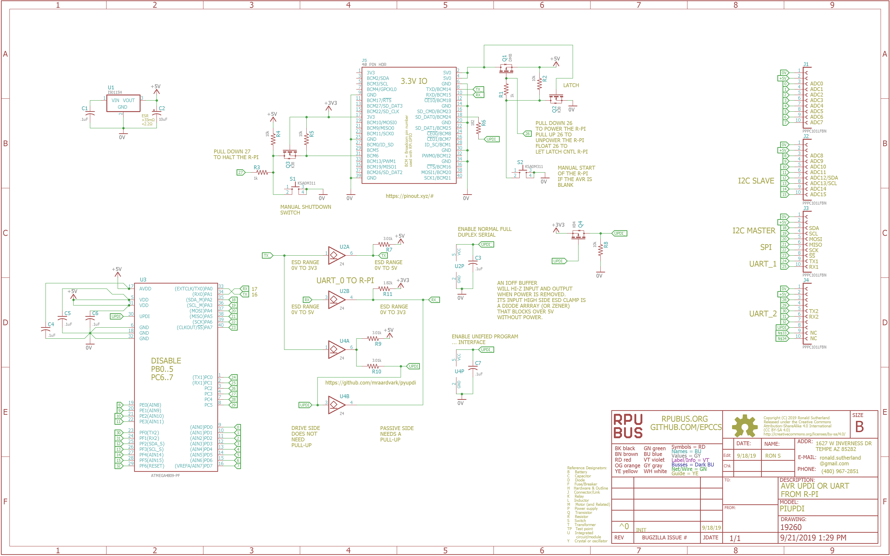

# Hardware

## Overview

This board allows a Raspberry Pi serial hardware port (or [adaptor] board) to interface with a multi-drop. A local AVR128DA28 is on the multi-drop. Programing is done through the serial interface when a target (e.g., the local AVR128DA28) is is set by the manager for UPDI mode (the preferred method for all new AVRs).

[adaptor]: https://github.com/epccs/RPUusb


## Inputs/Outputs/Functions

```
        TBD
```


## Uses

```
        TBD
```


## Notice

```
        TBD
 ```


# Table Of Contents

1. [Status](#status)
2. [Design](#design)
3. [Bill of Materials](#bill-of-materials)
4. [How To Use](#how-to-use)


# Status


```
        ^2  Done: Design, Layout, BOM,
            WIP: Review* (#= done),
            Todo: Order Boards, Assembly, Testing, Evaluation.
            *during review the Design may change without changing the revision.
            # LVT12R0100FER smd 1206 metal current sense element 0.01 Ohm 1W (e.g. 10A max)
            # change name on board to MacGyver
            # AVR128DB has two power domains, but its logistics is a mystery to me at this time.
            # Use 10k Ohm to discharge the UPDI mode controled with BCM24
            # Use 10k Ohm to discharge the UART mode controled with BCM23
            # Remove SPI between R-Pi and App MCU; it should be available (e.g., sdcard, psram...)
            # Rename DTR pair to OOB (Out Of Band).
            # Remove RTS/CTS, without a bootloader they will not be needed

        ^1  Done: Design, Layout, BOM, Review* (#= done), Order Boards,
            WIP: Assembly, 
            Todo: Testing, Evaluation.
            *during review the Design may change without changing the revision.
            # swap the m4809 for a AVR128DA28
            # UART0 crossover connection to R-Pi
 
            ^0  Done: Design, Layout, BOM, Review*, Order Boards,
            WIP: Assembly (will not do),
            Todo: Testing, Evaluation.
            *during review the Design may change without changing the revision.
            note this was not tested, and an error has been found with serial.
            # use Python https://github.com/mraardvark/pyupdi to upload AVR from R-Pi Zero
```

Debugging and fixing problems i.e. [Schooling](./Schooling/)

Setup and methods used for [Evaluation](./Evaluation/)


# Design

The board is 0.063 thick, FR4, two layer, 1 oz copper with ENIG (gold) finish.







## Electrical Schematic



## Testing

Check correct assembly and function with [Testing](./Testing/)


# Bill of Materials

The BOM is a CVS file, import it into a spreadsheet program like LibreOffice Calc (or Excel), or use a text editor.

Option | BOM's included
----- | ----- 
A. | [BRD] 
M. | [BRD] [SMD] [HDR] 
N. | [BRD] [SMD] [HDR] [POL] [PLUG]

[BRD]: ./Design/19260BRD,BOM.csv
[HDR]: ./Design/19260HDR,BOM.csv
[PLUG]: ./Design/19260PLUG,BOM.csv
[POL]: ./Design/19260POL,BOM.csv
[SMD]: ./Design/19260SMD,BOM.csv

[Order Form](https://rpubus.org/Order_Form.html)


# How To Use

Your [Raspberry Pi] is your computer, you are the expert because I am not. Don't buy this board and expect that I can help with your computer, I can not. 

[Raspberry Pi]: https://www.raspberrypi.org/forums/

## Pi Zero Setup 

The Pi Zero is a Single Board Computer (SBC) running [Linux]. I use it as a network machine and to run a toolchain at the network edge. It has enough memory and processing power for the AVR toolchain (and others that I have not tested). It also does self-hosted compiling (e.g., compiles programs to run on itself) and has lots of applications and services. My use is sort of like a headless test bench computer embedded next to the bare metal control boards. It is a classic control system with a host and instruments on a communication bus (hard-link, e.g., GPIB and ilk), but it is headless, so I interact with the target over an SSH session where I run programs that operate the hard-link. 

[Linux]: https://github.com/epccs/RPUpi/blob/master/Hardware/Testing/linux.md

The BCM2835 Broadcom chip used in the Raspberry Pi Zero is an ARM11 running at 1 GHz it has support with the [Raspbian] distribution. 

[Raspbian]: https://www.raspbian.org/


## Serial

The Pi serial port (RX is BCM 15 and TX is BCM 14) is crossover connected to the AVR128DA28 serial. 


UPDI does not use the nRTS/nCTS pins (16/17).

Note: version ^0 did not crossover.
