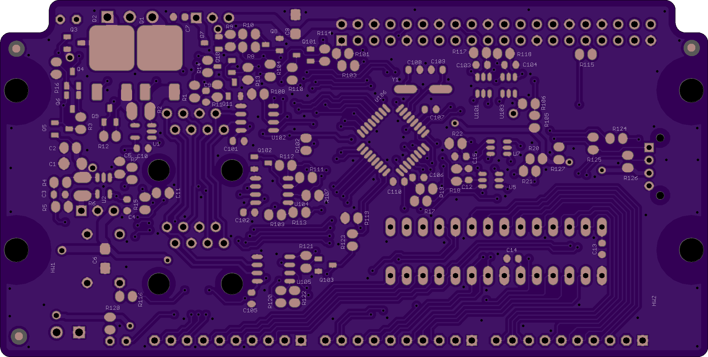
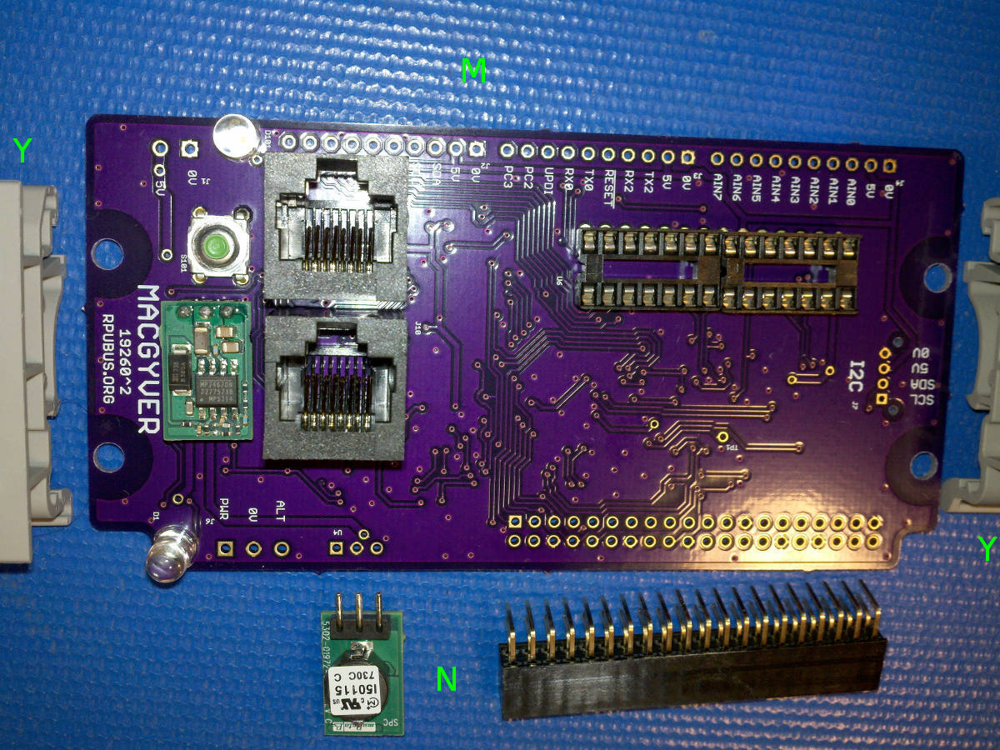

# Hardware

## Overview

This board allows a Raspberry Pi serial hardware port (or [adaptor] board) to interface with a multi-drop. A local AVR128DA28 is on the multi-drop for applications. Programing is done through the serial interface when a target (e.g., the local AVR128DA28) is set by the manager (AVR128DB32) for UPDI mode. An uploaded program is sometimes called firmware; it is binary instructions (16 x 64k) executed at one per clock (with few exceptions). The instructions operate on 32 registers and 16k bytes of SRAM, for which the datasheet and related application notes have details.

[adaptor]: https://github.com/epccs/RPUusb


## Inputs/Outputs/Functions

```
        TBD
```


## Uses

```
        TBD
```


## Notice

```
        TBD
 ```


# Table Of Contents

1. [Status](#status)
2. [Design](#design)
3. [Bill of Materials](#bill-of-materials)
4. [How To Use](#how-to-use)


# Status


```
        ^3  Done: 
            WIP:
            Todo: Design, Layout, BOM, Review* (#= done), Order Boards,  Assembly, Testing, Evaluation.
            *during review the Design may change without changing the revision.
            J9 J10 renumber to J8 J9
            TO_RPU_TX has two pullup (R19 and R104), remove R104. 
            Connect Manager Debug UART (MVIO_RX1 and MVIO_TX1) to test points.
            Add test point to 0V and PI3V3 for level shifting the debug uart test points.
            R104 is an extra pull-up on TO_RPU_TX; use it to pull-up FROM_RPU_TX instead.
            Rename PC2 and PC3 nodes MVIO_SDA0 and MVIO_SCL0 (used for R-Pi SMBus)
            Rename PF2 and PF3 nodes MGR_SDA1 and MGR_SCL1 (used between manager and applicaion)
            Rename PF4 and PF5 nodes MGR_SETAPP4_UART and MGR_SETAPP4_UPDI

        ^2  Done: Design, Layout, BOM, Review* (#= done), Order Boards, Assembly,
            WIP: Testing,
            Todo: Evaluation.
            *during review the Design may change without changing the revision.
            # LVT12R0100FER smd 1206 metal current sense element 0.01 Ohm 1W (e.g. 10A max)
            # change name on board to MacGyver
            # AVR128DB has two power domains, but its logistics is a mystery to me at this time.
            # Use 10k Ohm to discharge the UPDI mode controled with BCM24
            # Use 10k Ohm to discharge the UART mode controled with BCM23
            # Remove SPI between R-Pi and App MCU; it should be available (e.g., sdcard, psram...)
            # Rename DTR pair to OOB (Out Of Band).
            # Remove RTS/CTS, without a bootloader they will not be needed

        ^1  Done: Design, Layout, BOM, Review* (#= done), Order Boards, Assembly, Testing,
            WIP: Evaluation.
            Todo:  
            *during review the Design may change without changing the revision.
            # swap the m4809 for a AVR128DA28
            # UART0 crossover connection to R-Pi
 
            ^0  Done: Design, Layout, BOM, Review*, Order Boards,
            WIP:  stopped due to a serial crossover mistake
            Todo: Assembly, Testing, Evaluation.
            *during review the Design may change without changing the revision.
            note this was not tested, and an error has been found with serial.
            # use Python https://github.com/mraardvark/pyupdi to upload AVR from R-Pi Zero
```

Debugging and fixing problems i.e. [Schooling](./Schooling/)

Setup and methods used for [Evaluation](./Evaluation/)


# Design

The board is 0.063 thick, FR4, two layer, 1 oz copper with ENIG (gold) finish.







## Electrical Schematic


## Testing

Check correct assembly and function with [Testing](./Testing/)


# Bill of Materials

The BOM is a CVS file, import it into a spreadsheet program like LibreOffice Calc (or Excel), or use a text editor.

Option | BOM's included
----- | ----- 
A. | [BRD]
J. | [BRD] [SMD] [HDR]
M. | [BRD] [SMD] [HDR] [CAT5]
N. | [BRD] [SMD] [HDR] [CAT5] [POL]
Y. | [BRD] [SMD] [HDR] [CAT5] [POL] [DIN] [PLUG] 

[BRD]: ./Design/19260BRD,BOM.csv
[CAT5]: ./Design/19260CAT,BOM.csv
[DIN]: ./Design/19260DIN,BOM.csv
[HDR]: ./Design/19260HDR,BOM.csv
[PLUG]: ./Design/19260PLUG,BOM.csv
[POL]: ./Design/19260POL,BOM.csv
[SMD]: ./Design/19260SMD,BOM.csv

[Order Form](https://rpubus.org/Order_Form.html)


# How To Use

Your [Raspberry Pi] is your computer, you are the expert because I am not. Don't buy this board and expect that I can help with your computer, I can not. 

[Raspberry Pi]: https://www.raspberrypi.org/forums/

## Pi Zero Setup 

The Pi Zero is a Single Board Computer (SBC) running [Linux]. I use it as a network machine and to run a toolchain at the network edge. It has enough memory and processing power for the AVR toolchain (and others that I have not tested). It also does self-hosted compiling (e.g., compiles programs to run on itself) and can run lots of applications and services. My use is sort of like a headless computer embedded next to the control boards. It is a classic control system with a host and devices on a communication bus (hard-link, e.g., GPIB and ilk), but it is headless, so I interact with the target through an SSH session with the remote SBC where I can then run programs that operate the hard-link as a local connection. 

[Linux]: https://github.com/epccs/RPUpi/blob/master/Hardware/Testing/linux.md

The BCM2835 Broadcom chip used in the Raspberry Pi Zero is an ARM11 running at 1 GHz it has support with these [distribution]. 

[distribution]: https://www.raspberrypi.org/software/operating-systems/


## Serial

The Pi serial port (RX is BCM 15 and TX is BCM 14) is crossover connected through the Multi-Drop Bus (MDB) to the AVR128DA28 serial. 


UPDI does not use the nRTS/nCTS pins (16/17).

Note: version ^0 did not crossover.


## No Bootloader

That is correct. There is no bootloader. The programming interface (UPDI) is based on a half-duplex asynchronous serial. For reference, the ARM serial-wire (SWCLK, SWDIO) is based on synchronous serial. A UPDI uploader program (e.g., pyupdi or pymcuprog) can directly use the serial channel, which has hardware for full-duplex to the target. A pair of buffers are enabled to connect the full-duplex to the half-duplex programming/debugging pin of the target. You can set any fuse, code protection, and functional safety feature. An erase will always clear the part so another program and fuse combination can be loaded. Thus no bricking is possible, but you can wear out the flash memory (rated for 10k writes).

