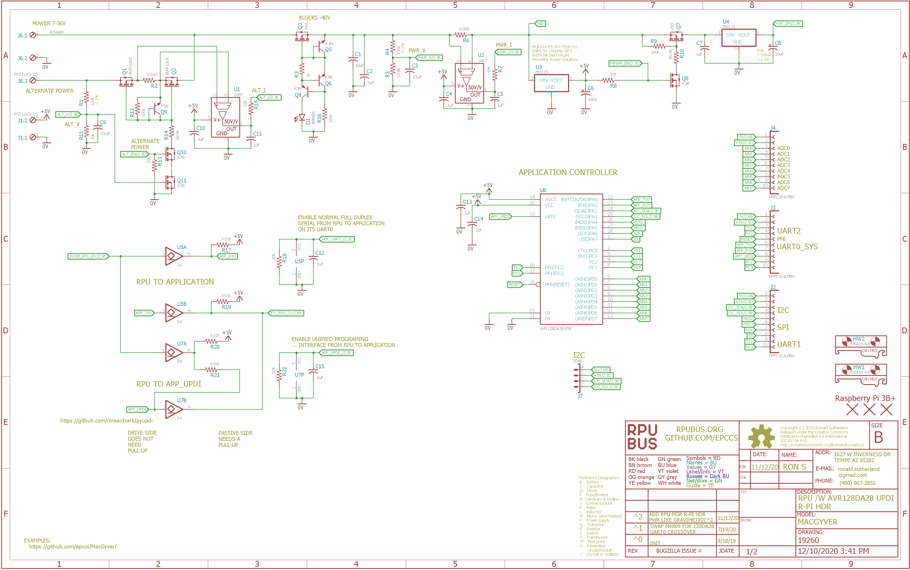

# Hardware

## Overview

This board connects a Pi Zero [W] to an ATmega4809-PF by way of serial or UPDI.


## Inputs/Outputs/Functions

```
        TBD
```


## Uses

```
        TBD
```


## Notice

```
        TBD
 ```


# Table Of Contents

1. [Status](#status)
2. [Design](#design)
3. [Bill of Materials](#bill-of-materials)
4. [How To Use](#how-to-use)


# Status


```
        ^0  Done: Design, Layout, BOM, 
            WIP: Review*,
            Todo: Order Boards, Assembly, Testing, Evaluation.
            *during review the Design may change without changing the revision.
```

Debugging and fixing problems i.e. [Schooling](./Schooling/)

Setup and methods used for [Evaluation](./Evaluation/)


# Design

The board is 0.063 thick, FR4, two layer, 1 oz copper with ENIG (gold) finish.


## Electrical Schematic



## Testing

Check correct assembly and function with [Testing](./Testing/)


# Bill of Materials

The BOM is a CVS file, import it into a spreadsheet program like LibreOffice Calc (or Excel), or use a text editor.

Option | BOM's included
----- | ----- 
A. | [BRD] 
M. | [BRD] [SMD] [HDR] 
N. | [BRD] [SMD] [HDR] [POL]

[BRD]: ./Design/19260BRD,BOM.csv
[SMD]: ./Design/19260SMD,BOM.csv
[HDR]: ./Design/19260HDR,BOM.csv
[POL]: ./Design/19260POL,BOM.csv

[Order Form](https://rpubus.org/Order_Form.html)


# How To Use

Your [Raspberry Pi] is your computer, you are the expert because I am not. Don't buy this board and expect that I can help with your computer, I can not. So far I have found that SSH works and the AVR toolchain. 

[Raspberry Pi]: https://www.raspberrypi.org/forums/

## Pi Zero Setup 

The Pi Zero is a Single Board Computer (SBC) running [Linux]. I use it as a network machine and to run a toolchain at the network edge. It has enough memory and processing power for the AVR toolchain (and others that I have not tested). It also does self-hosted compiling for (e.g. compiles programs to run on itself) and has lots of applications and services. My use is sort of like a headless test bench computer embedded next to the bare metal control boards, I daisy-chain the serial to each target I want to bootload. Is it IoT, no it is not, it is a classic control system (but it is headless), but I can interact with the target boards over an SSH session (e.g. in other words it does what IoT should). 

[Linux]: https://github.com/epccs/RPUpi/blob/master/Hardware/Testing/linux.md

The BCM2835 Broadcom chip used in the Raspberry Pi Zero is an ARM11 running at 1 GHz it has good support with the [Raspbian] distribution. 

[Raspbian]: https://www.raspbian.org/


## Serial

The Pi serial port (RX is BCM 15 and TX is BCM 14) is crossover connected to the ATmega4909-PF serial. 


UPDI does not use the nRTS/nCTS pins (16/17).


