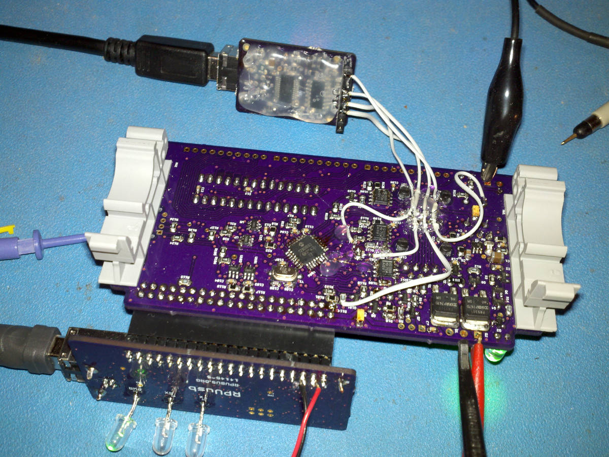

# Description

Some lessons I learned doing MacGyver.

# Table Of Contents:

1. ^2 Manager Debug UART
1. ^1 UPDI Mode Does Not Turn Off
1. ^1 Name
1. ^0 Serial 0 Does Not Crossover

## ^2 Manager Debug UART

It needs to connect to an off-board UART like USBuart (with has IOFF buffers).

Cut RX1 and TX1 from the manager, and run jumpers with RX1 and TX1 to a header for USBuart. Do not connect it to the onboard serial (that did not work). 

I had the RX1 and TX1 pins flipped in io_enum.h; that is fixed, the RX1 pin is reading data from USBuart, but the TX1 pin has a 100 Hz square wave.

The output is 1kHz and is from PWM; when the PWM is set up and routed, it is then enabled with the output direction control. I guess I will route it to PORTG for now, which does not connect to I/O pins.

## ^1 UPDI Mode Does Not Turn Off

Using RPUusb the m238pb resets and the pin goes hi-z after enabling UPDI mode. 

To help understan the problem I isolated UPDI mode to BCM24 and UART mode to BCM23. Also added a 10k Ohm pull down on UPDI mode. Then I found that I had forgot to init the pins as an output in the i2c-debug program (see [RPUusb_029ec11]) so I was turning on and off a weak pullup (that was more days than I want to admit).

[RPUusb_029ec11]: https://github.com/epccs/RPUusb/commit/029ec1194d0428e7181b6f8db35fa39c39068542

## ^1 Name

PiUpdi (the original name) is almost the same as the upload tool (pyupdi), don't do that. There are lots of unintentional consequences that happen after naming a thing. If I am getting confused, then others may also, it is best just to change the name. I have seen letter combinations that did not previously exist on the internet turn into unpleasant references, so I would preferably use a word that is in regular use, even though it makes the board invisible (I guess search for "MacGyver AVR"). I don't recall watching many of the TV shows, but some of the memes seem fitting. 

## ^0 Serial 0 Does Not Crossover

This layout was not tested but during the layout of ^1 I noted that the serial did not crossover to the R-Pi (opps).

