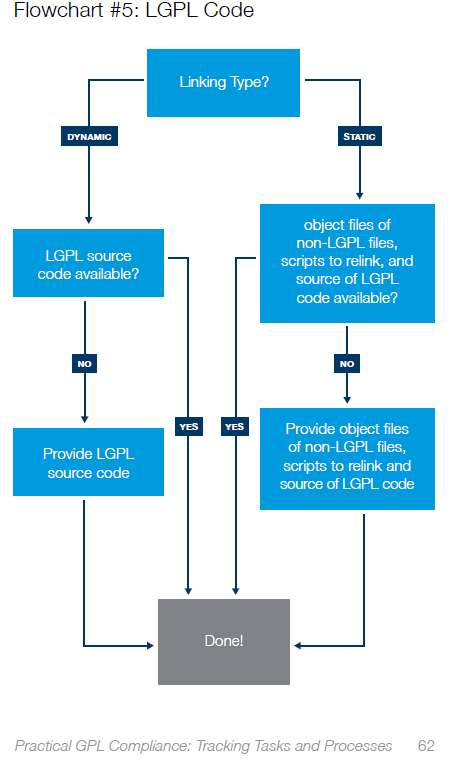

#  License

```
PiUpdi (product) is a collection of Software provided by Ronald Sutherland. Each software has a 
license that will grant permissions. Subject to your compliance with the software terms, you may use 
it and derivatives. It is your responsibility to comply with the license terms applicable to your use of 
the software (including third party software) that accompany Ronald Sutherland software.

NOTE! This license does *not* cover "standalone" applications that a user may develop and provide for use 
with the product applicaiton MCU this is merely considered normal use of the product, and does *not* 
fall under the heading of "derived work" -- see file  Licenses/Exceptions for details.

Also note that the GPL and the other licenses are copyrighted by the Free Software Foundation and other 
organizations, but the instance of code that they refer to (the product source code) is copyrighted by me 
and others who actually wrote it. -- Ronald Sutherland

THIS SOFTWARE IS SUPPLIED BY RONALD SUTHERLAND "AS IS". NO WARRANTIES, WHETHER
EXPRESS, IMPLIED OR STATUTORY, APPLY TO THIS SOFTWARE, INCLUDING ANY
IMPLIED WARRANTIES OF NON-INFRINGEMENT, MERCHANTABILITY, AND FITNESS
FOR A PARTICULAR PURPOSE.

IN NO EVENT WILL RONALD SUTHERLAND BE LIABLE FOR ANY INDIRECT, SPECIAL, PUNITIVE,
INCIDENTAL OR CONSEQUENTIAL LOSS, DAMAGE, COST OR EXPENSE OF ANY KIND
WHATSOEVER RELATED TO THE SOFTWARE, HOWEVER CAUSED, EVEN IF RONALD SUTHERLAND
HAS BEEN ADVISED OF THE POSSIBILITY OR THE DAMAGES ARE FORESEEABLE. TO
THE FULLEST EXTENT ALLOWED BY LAW, RONALD SUTHERLAND'S TOTAL LIABILITY ON ALL
CLAIMS IN ANY WAY RELATED TO THIS SOFTWARE WILL NOT EXCEED THE AMOUNT
OF FEES, IF ANY, THAT YOU HAVE PAID DIRECTLY TO RONALD SUTHERLAND FOR THIS
SOFTWARE.
```

Each source file that can be compiled into an Executable and Linkable Format (e.g., ELF) and then linked with an application has a license within its source. 

A BSD license is used on the example software that runs on the *application* microcontroller; a developer can derive their software from it and then distribute the object (ELF) in any way chosen. If an example links with an LGPL source, the developer needs to publish their objects and build scripts so that the recipient can modify the LGPL source and link with the distributers provided object (ELF) file. Note my files should not be LGPL; let me know if I have made a mistake.

If the application microcontroller has a bootloader that is a GPL license, there should be an exception that makes it clear that when it loads the firmware, the result is not a derivative. The application microcontroller may have a UPDI port that can upload and interact with the machine resources in sophisticated and proprietary ways, but the result is again not a derivative.



https://www.linuxfoundation.org/open-source-management/2017/05/practical-gpl-compliance/

The flowchart above is from "Practical GPL Compliance" and is for section 4.d of the LGPL. The preprocessor includes headers before compiling, so there needs to be a way to allow that. If a header has an LGPL license, the preprocessor will trigger the need to publish when it is included because the result is a derivative. Section 3 is what allows using header files. 

https://www.gnu.org/licenses/lgpl-3.0.txt

The ideas that LGPL seems to embody is based on Linking ELF objects and distributing software that allows the receiving party to change there LGPL code even though they can not change the rights reserved software. It is probably worth knowing what an ELF object is to help understand.

https://en.wikipedia.org/wiki/Executable_and_Linkable_Format


